# Tích hợp Grafana OnCall OSS với Slack

## Triển khai Grafana OnCall OSS tại Local

1. Triển khai Docker

```bash
docker-compose up --build
```

2. Đăng nhập sử dụng admin/admin


3. Trang chủ với các hướng dẫn thêm Nguồn Dữ Liệu/Bảng Điều Khiển


## Mở Grafana OnCall


## Mở port ra ngoài public mạng

1. Cài đặt zrok

https://docs.zrok.io/docs/guides/install/


2. Đăng nhập zrok lấy token để xác thực

https://api-v1.zrok.io


```bash
zrok.exe enable <token>
```


3. Vì port của OnCall Engine là 8080 nên ta sẽ chạy lệnh sau


```bash
zrok.exe share public 8080
```

## Cài đặt Slack WebHook

1. Tạo Workspace

https://slack.com/create


2. Tạo Slack App

https://api.slack.com/apps


Chọn From a manifest và chọn workspace vừa tạo để điền nội dung từ manifest.yml vô.

Nhớ đổi **<ONCALL_ENGINE_PUBLIC_URL>** thành link zrok vừa tạo ở trên


## Từ thông tin Slack App, nhập vào Grafana OnCall Setup ENV VARIABLES

1. Nhập thông tin


```js
SLACK_CLIENT_OAUTH_ID = Basic Information -> App Credentials -> Client ID
SLACK_CLIENT_OAUTH_SECRET = Basic Information -> App Credentials -> Client Secret
SLACK_SIGNING_SECRET = Basic Information -> App Credentials -> Signing Secret
SLACK_INSTALL_RETURN_REDIRECT_HOST = << OnCall external URL >>
```


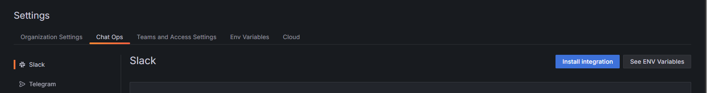

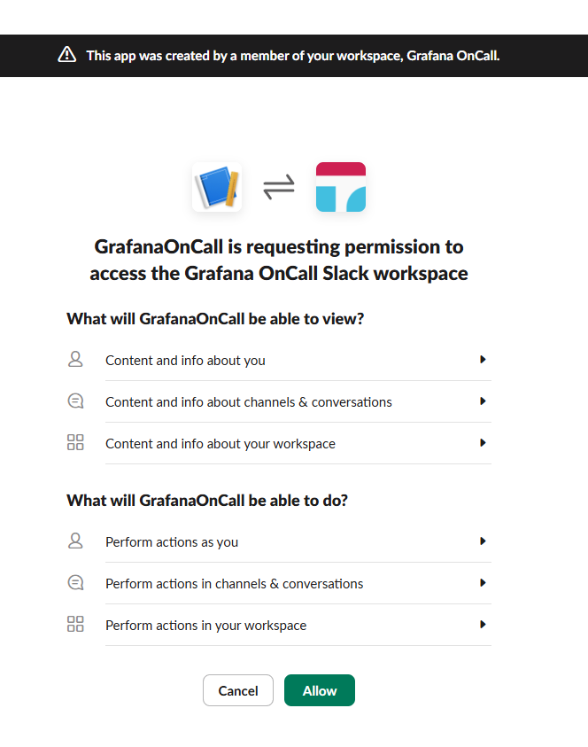

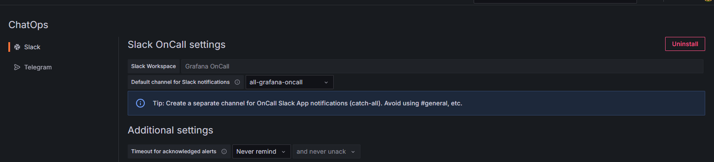

2. Cài đặt thông báo qua Slack cho tài khoản

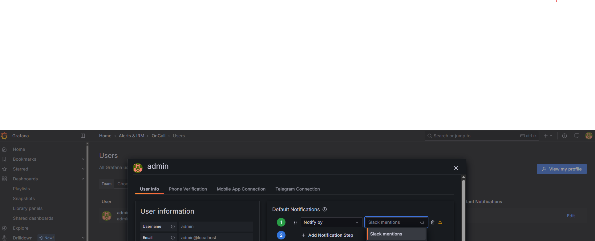

3. Test nhận thông báo qua Slack

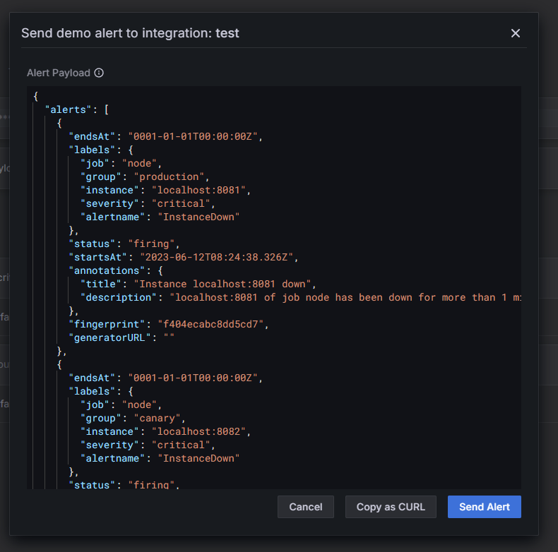

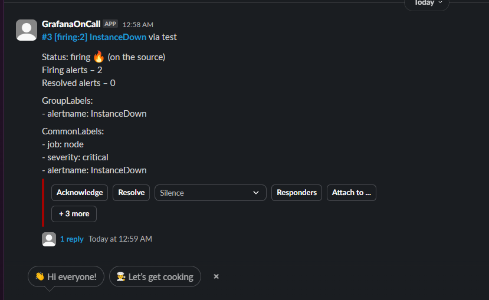


## Alert Manager

1. Cài đặt Link URL Integration


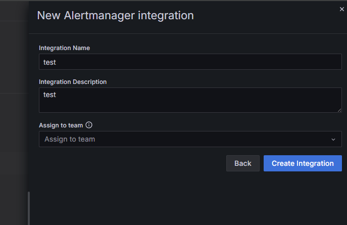

Nhập URL vào file **./alertmanager/alertmanager.yml**

2. Cài đặt Prometheus Alert Manager

```bash
docker-compose -f docker-prometheus-compose.yml up --build
```

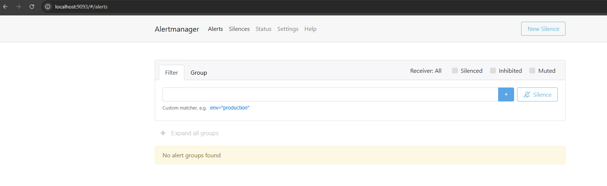

3. Gắn link Integration qua bên Prometheus Alert Manager

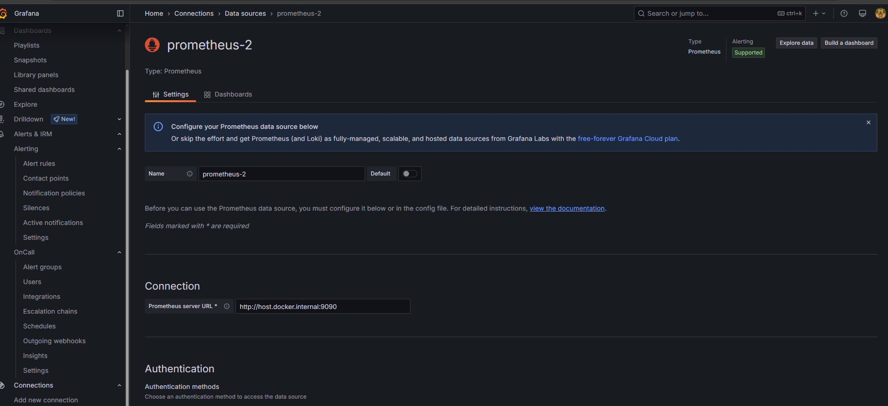

### Kết quả cuối cùng

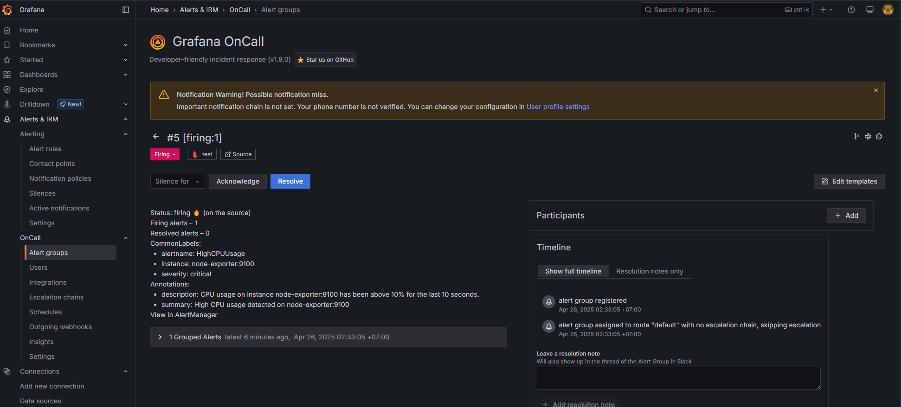

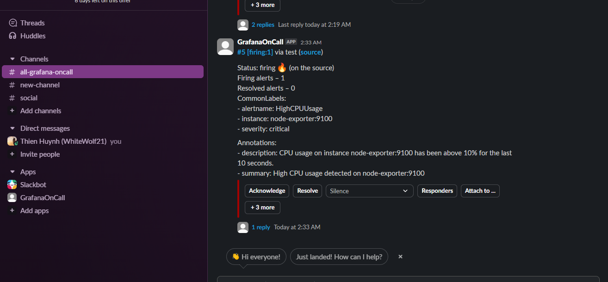

